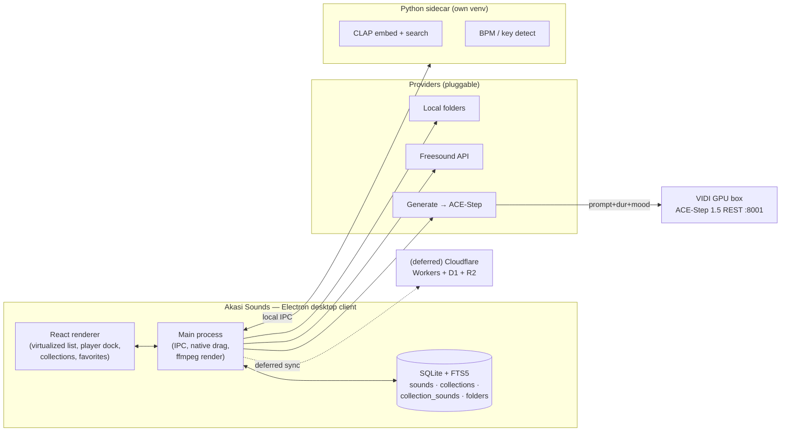
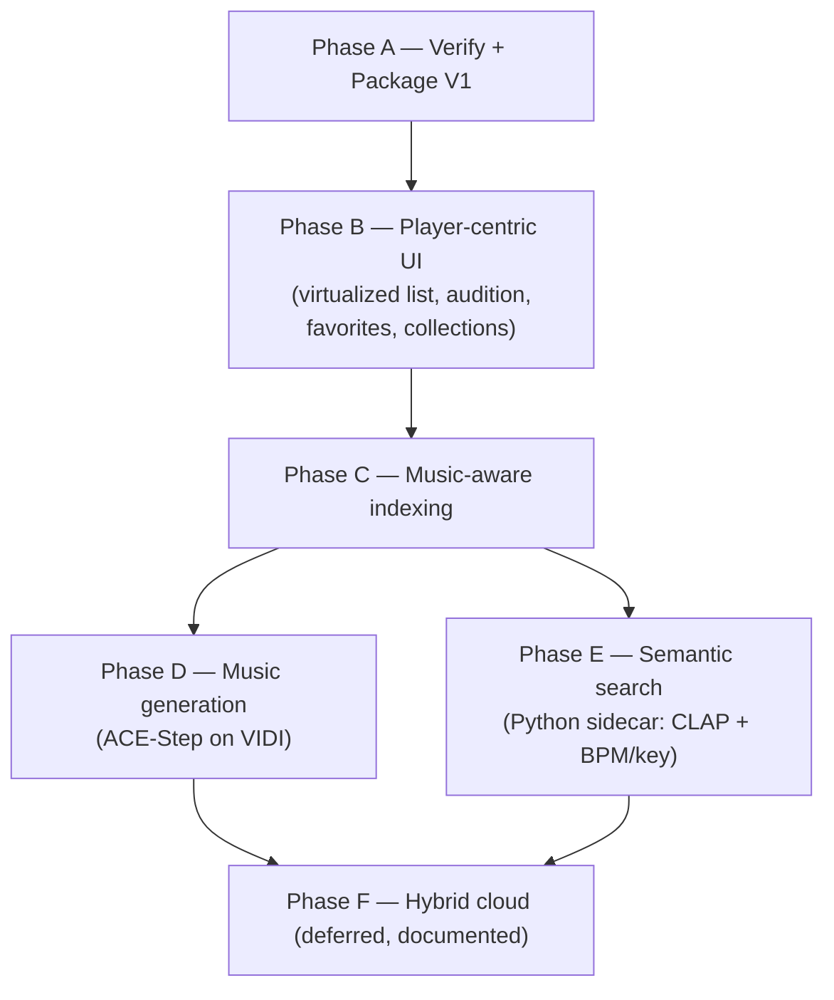

# feat: Akasi Sounds — full roadmap (player-centric SFX + music manager with generation)

**Created:** 2026-07-01
**Type:** feat
**Depth:** Deep
**Target repo:** akasi-sounds (`~/code/akasi/akasi-sounds`, private `Dlove7777/akasi-sounds`)

---

## Summary

Take Akasi Sounds from a verified-backend V1 to a shipped, player-centric desktop app: a fast library manager where an editor searches and auditions through hundreds-to-thousands of SFX **and music** files, marks favorites, groups them into collections, and drags a cropped/faded clip straight onto a Premiere/Resolve/FCP timeline. Then extend it with on-VIDI music generation, semantic search, and an optional cloud backend. Licensing and training-data provenance are first-class throughout because output lands in commercial client edits.

---

## Problem Frame

V1 proved the hard parts work (SQLite+FTS search, Freesound pull, ffmpeg crop/fade render, native drag) but has never run in Electron and its UI is a plain list built for a handful of rows. The product only becomes useful at editing speed: scrolling and auditioning **hundreds** of results without lag, keyboard-first previewing, and organizing sounds into reusable collections. Music is a distinct need from SFX — editors want beds/cues, browse them by BPM/key/genre, and increasingly want to *generate* a bespoke underscore when the library has no fit. Every one of those generated or downloaded assets may end up in paid client work, so the plan cannot treat licensing as a footnote.

---

## Requirements

- **R1** — App launches and runs as a real Electron desktop app on macOS (Apple Silicon), not just headless backend.
- **R2** — Results list stays smooth (no dropped frames, instant scroll) at 1,000+ rows.
- **R3** — Keyboard-first audition: select a row and it previews within ~100ms; arrow keys move + auto-play; Space toggles play/pause.
- **R4** — Favorites: one-click toggle, persisted, filterable as a scope.
- **R5** — Collections: user-defined groups; a sound can belong to many; add/remove from the UI; browse by collection.
- **R6** — Music-aware indexing: extract embedded metadata (title/artist/album/genre/BPM/year) on scan; a "Music" scope; display music columns.
- **R7** — Drag-to-timeline continues to work for local, cached-remote, and generated sounds (rendered WAV via ffmpeg).
- **R8** — Music generation: prompt + duration + mood → a generated WAV that lands in the library like any other sound, auditioned/cropped/dragged the same way.
- **R9** — Generation runs on a commercial-safe, self-hosted model (ACE-Step, Apache-2.0) on VIDI; MusicGen (non-commercial weights) is excluded.
- **R10** — Semantic search: "describe the sound" queries via CLAP embeddings, blended with keyword FTS.
- **R11** — Every sound's license + attribution is visible and preserved; a project can export a credits/attribution manifest.
- **R12** — Packaged, signed-capable installer (`.dmg`) produced via a repeatable release pipeline.

---

## Key Technical Decisions

- **KTD1 — Stay Electron desktop; cloud is backend-only if pursued.** The native drag-to-timeline and local-folder indexing cannot be done from a browser (verified market pattern: Soundly/SoundQ/BaseHead are all desktop). Any cloud work is a *backend* for library/search/generation/sync behind the same desktop client.
- **KTD2 — Virtualize the results list.** Rendering 1,000+ DOM rows kills scroll performance. Use windowed rendering (render only visible rows). This is the single most important UI decision for R2/R3.
- **KTD3 — Audition via streaming `<audio>` + lazy waveform.** Play starts from the file/preview URL immediately; waveform peaks decode asynchronously and don't block playback (already the V1 pattern — preserve it under virtualization).
- **KTD4 — Collections as a join table**, not tags. `collections` + `collection_sounds(collection_id, sound_id)`. Keeps a sound in many collections and lets collection browse be a fast indexed query. Favorites stay a boolean column (single-membership, hot path).
- **KTD5 — Music metadata V1 = embedded tags via ffprobe.** Real BPM/key *detection* is DSP and belongs with the Python sidecar (librosa/essentia) in the semantic-search phase. V1.5 reads existing ID3/Vorbis tags (genre/BPM/artist/album) — zero new heavy deps, immediate value. Detection is deferred, not faked.
- **KTD6 — Generation is a "Generate" provider + a remote GPU service.** ACE-Step 1.5 runs its REST server on VIDI; Akasi Sounds calls it exactly like the Freesound provider (search→results), except the "query" is a generation prompt. Result WAV is cached + indexed → identical downstream (audition/crop/drag). No new client architecture.
- **KTD7 — ACE-Step over Stable Audio Open as primary generator.** Apache-2.0 (commercial-clean), full-length tracks, REST server built in, runs on VIDI CUDA (<10s/song on a 3090-class card) with Apple-Silicon/MPS fallback on M1. Stable Audio Open (Freesound-CC-trained, cleanest provenance, short cues) is a deferred second provider for stingers/loops.
- **KTD8 — Semantic search via a Python sidecar in its own venv.** Node 3.14 has no torch wheels; the sidecar runs on an older Python (3.11/3.12), exposes CLAP embed + search over local IPC, and also does the deferred BPM/key detection. Keyword FTS keeps working with zero ML; semantic "lights up" when the sidecar/model is present.
- **KTD9 — Licensing is data, not prose.** Each sound row already carries `license` + `attribution`. Generated sounds record model + license (`ACE-Step 1.5 / Apache-2.0`). A project-level export produces a credits manifest (R11). Provenance ranking: CC0/Apache > CC-BY > CC-BY-NC (flagged non-commercial, excluded from client exports).

---

## High-Level Technical Design

### Component / data flow



### Phasing (dependency-ordered)



Phases A–C are buildable + verifiable now (backend headless + renderer preview). Phases D–E need VIDI/GPU + a display for full verification. Phase F is documented direction, not decomposed.

---

## Output Structure (new/changed)

```
akasi-sounds/
├── electron/
│   ├── main.js            # + collections IPC, generate IPC
│   └── preload.js         # + collections, generate bridge
├── src/
│   ├── db.js              # + collections tables, music columns, queries
│   ├── indexer.js         # + ffprobe tag extraction
│   ├── providers/
│   │   ├── index.js
│   │   ├── freesound.js
│   │   └── generate.js    # NEW — ACE-Step provider
│   └── sidecar/           # NEW (Phase E) — python CLAP/DSP service
├── renderer/
│   ├── App.jsx            # scopes: Library/Favorites/Music/Collections/Generate
│   ├── components/
│   │   ├── ResultsList.jsx   # NEW — virtualized
│   │   ├── SoundRow.jsx      # NEW
│   │   ├── Sidebar.jsx       # NEW — scopes + collections
│   │   ├── Waveform.jsx      # existing player dock
│   │   └── GeneratePanel.jsx # NEW (Phase D)
│   └── styles.css
├── services/vidi-acestep/  # NEW (Phase D) — deploy scripts for VIDI
└── docs/plans/
```

---

## Implementation Units

### U1. First real Electron launch + boot fixes
**Goal:** Confirm the app opens, loads the renderer, and the IPC surface works in Electron (not just headless).
**Requirements:** R1
**Dependencies:** none
**Files:** `electron/main.js`, `electron/preload.js`, `package.json`
**Approach:** `npm install` (pulls Electron + rebuilds better-sqlite3 for the Electron ABI via postinstall), `npm run dev`. Confirm window opens, search returns rows, a Freesound search caches + plays, drag produces a file. Fix any ABI/path/CSP issues surfaced on first boot. **This run requires a display — it is the one Dennis-run prerequisite; packaging (U2/U3) depends on it.**
**Test scenarios:**
- App boots to the library view without a blank/white screen.
- Keyword search returns rows; selecting one plays audio.
- Freesound search caches a preview and plays it.
- Drag-out yields a real WAV on the desktop.
**Verification:** App runs interactively; the four scenarios pass on-device.

### U2. Validate electron-builder packaging (.dmg)
**Goal:** Produce an installable macOS `.dmg`.
**Requirements:** R12
**Dependencies:** U1
**Files:** `package.json` (build block — present), `.gitignore`
**Approach:** `npm run dist:mac`. Confirm `dist-app/*.dmg` installs and launches (unsigned → Gatekeeper right-click-open). Note signing/notarization as a follow-up needing `APPLE_ID`/`CSC_LINK`.
**Test scenarios:** `.dmg` builds; installed app launches and reaches the library view.
**Verification:** Installer opens the working app on a clean macOS user.

### U3. Release pipeline (tag → installers)
**Goal:** Repeatable release via GitHub Actions.
**Requirements:** R12
**Dependencies:** U2
**Files:** `.github/workflows/release.yml` (present)
**Approach:** Push `vX.Y.Z` tag → CI builds mac/win/linux installers, attaches to a GitHub Release. Unsigned until signing secrets added.
**Test scenarios:** Tag push triggers a green build; Release has artifacts attached.
**Verification:** A Release exists with downloadable installers.
**Execution note:** Only cut a release tag after U1 confirms the app runs — a green CI build does not prove runtime correctness (electron-builder doesn't launch the app).

### U4. Virtualized results list
**Goal:** Smooth scroll + interaction at 1,000+ rows.
**Requirements:** R2
**Dependencies:** U1
**Files:** `renderer/components/ResultsList.jsx`, `renderer/components/SoundRow.jsx`, `renderer/App.jsx`, `renderer/styles.css`
**Approach:** Windowed rendering — only visible rows mount. Keep row height fixed for simple windowing. Extract the row markup from `App.jsx` into `SoundRow`. Preserve current columns (star, source badge, name, tags, duration, license) + add a collection-add affordance on hover.
**Patterns to follow:** existing `.row` grid in `styles.css`; keep the CSS-grid columns.
**Test scenarios:**
- 2,000 mock rows scroll without jank; only ~visible rows are in the DOM.
- Selecting a row still triggers audition (no regression).
- Keyboard up/down moves selection and keeps the selected row in view.
**Verification:** Preview with 2,000 rows scrolls smoothly; DOM node count stays bounded.

### U5. Keyboard-first audition
**Goal:** Fast, hands-on-keyboard preview through many files.
**Requirements:** R3
**Dependencies:** U4
**Files:** `renderer/App.jsx`, `renderer/components/Waveform.jsx`
**Approach:** ↑/↓ move selection and auto-play the newly selected sound; Space play/pause; ←/→ seek. Debounce audition resolve so rapid arrow-scrubbing doesn't spawn dozens of fetches (resolve the sound that's still selected after ~120ms). Start `<audio>` playback immediately; waveform decodes async (KTD3).
**Test scenarios:**
- Holding ↓ moves selection quickly without a fetch storm (debounced).
- Releasing on a row auto-plays it within ~100ms.
- Space toggles; ←/→ seek ±1s.
**Verification:** Arrow-key walk through a list auditions each sound near-instantly with no audio overlap.

### U6. Favorites polish + scope
**Goal:** Reliable one-click favorite, filterable.
**Requirements:** R4
**Dependencies:** U4
**Files:** `renderer/App.jsx`, `src/db.js` (existing `toggleFavorite`)
**Approach:** Star toggles optimistic in the list; Favorites scope filters `favorite=1`. Already partly built — verify under virtualization and persist across sessions.
**Test scenarios:** Toggle persists across relaunch; Favorites scope shows only starred; star reflects state in both scopes.
**Verification:** Favoriting and filtering behave consistently in the running app.

### U7. Collections (data model + UI)
**Goal:** User-defined groups; a sound in many; browse by collection.
**Requirements:** R5
**Dependencies:** U4
**Files:** `src/db.js`, `electron/main.js`, `electron/preload.js`, `renderer/components/Sidebar.jsx`, `renderer/App.jsx`
**Approach:** New tables `collections(id, name, created_at)` + `collection_sounds(collection_id, sound_id, added_at, PRIMARY KEY(collection_id, sound_id))` (KTD4). DB methods: create/rename/delete collection, add/remove sound, list collections (+counts), search-within-collection. IPC + preload bridge. Sidebar lists collections with counts + "New collection"; rows get an "add to collection" menu; selecting a collection scopes results to its members.
**Test scenarios:**
- Create a collection; add a sound; it appears when browsing that collection.
- Same sound added to two collections shows in both; removing from one leaves the other.
- Deleting a collection removes memberships (cascade) but not the sounds.
- Collection counts update on add/remove.
- Search within a collection scope filters to members only.
**Verification:** Backend smoke covers collection CRUD + membership; UI shows collections and scopes correctly.

### U8. Music-aware indexing (ffprobe tags + Music scope)
**Goal:** Index embedded music metadata; browse music as music.
**Requirements:** R6
**Dependencies:** U1
**Files:** `src/audio.js` (extend probe), `src/indexer.js`, `src/db.js`, `renderer/App.jsx`
**Approach (KTD5):** Extend the ffprobe call to read format tags (title, artist, album, genre, date, TBPM/`bpm`). Add nullable columns `artist, album, genre, bpm, year, kind` to `sounds` (kind = 'sfx'|'music', inferred: has music tags or lives under a "music" path segment). Music scope filters `kind='music'`; music rows show artist/genre/BPM columns. FTS already covers name+tags; fold artist/album/genre into the indexed tag text.
**Test scenarios:**
- An MP3 with ID3 genre/BPM/artist indexes those fields.
- A file with no music tags indexes as kind='sfx' with null music fields.
- Music scope shows only music-kind rows with the extra columns populated.
- Searching an artist/genre name returns the track (FTS includes them).
**Verification:** Backend smoke: probe a tagged file → fields present; scope query returns music rows.

### U9. ACE-Step generation service on VIDI *(deferred build — needs GPU box)*
**Goal:** A commercial-safe music generator reachable over HTTP.
**Requirements:** R8, R9
**Dependencies:** U8
**Files:** `services/vidi-acestep/` (deploy notes + launch script), no client change here
**Approach:** Install ACE-Step 1.5 on VIDI (CUDA), run its REST server (`:8001`), expose on the tailnet like the existing ComfyUI/Whisper services. Health-check + a smoke generation. Record the model+license string for provenance (KTD9). Apple-Silicon/MPS on M1 is the documented fallback if VIDI is busy.
**Test scenarios (service-level):** `/generate` with a prompt+duration returns a WAV; a 30s cue generates in a usable time budget; server survives repeated calls.
**Verification:** curl the VIDI endpoint → playable WAV with the right duration.
**Execution note:** Infrastructure deploy; gated on Dennis's go (per "don't push to launch"). Confirm VRAM headroom on VIDI before install.

### U10. "Generate" provider + Generate panel *(deferred build — depends on U9)*
**Goal:** Generation feels like any other library source.
**Requirements:** R8, R7, R11
**Dependencies:** U9, U7
**Files:** `src/providers/generate.js`, `src/providers/index.js`, `electron/main.js`, `electron/preload.js`, `renderer/components/GeneratePanel.jsx`, `renderer/App.jsx`
**Approach (KTD6):** New provider calls the VIDI endpoint; returns a normalized sound (source='generate', license='ACE-Step 1.5 / Apache-2.0', attribution=prompt). Result WAV caches + indexes → auditions/crops/drags identically. Generate panel: prompt, duration, mood/genre chips → generate → lands selected in the dock. Generated sounds are addable to collections/favorites like any other.
**Test scenarios:**
- Generate → row appears in library, plays, drags to timeline.
- Generated sound carries model+license attribution.
- Generated sound can be favorited and added to a collection.
**Verification:** End-to-end generate→audition→drag in the running app against a live VIDI service.

### U11. Semantic search sidecar (CLAP + BPM/key) *(deferred build — Python sidecar)*
**Goal:** "Describe the sound" search + real music analysis.
**Requirements:** R10, R6 (detection)
**Dependencies:** U8
**Files:** `src/sidecar/` (Python), `electron/main.js` (spawn+IPC), `src/db.js` (embedding + bpm/key population)
**Approach (KTD8):** Python venv (3.11/3.12) with CLAP; sidecar exposes embed(text/audio) + nearest-neighbor over stored embeddings, and librosa BPM/key detection to backfill the columns from U8. Main spawns it, talks over local IPC. Hybrid search blends FTS score + embedding similarity; a per-row dot shows match-by-sound vs match-by-name. Degrades to keyword-only when the sidecar/model is absent.
**Test scenarios:**
- With sidecar up, a descriptive query ("tense metallic riser") ranks perceptually-similar sounds above keyword-only.
- BPM/key backfill populates columns for a known-tempo track within tolerance.
- Sidecar down → search still returns keyword results (no crash).
**Verification:** Blended results demonstrably differ from pure keyword when the model is present; graceful fallback when not.

### U12. Attribution/credits export
**Goal:** Ship a project's license obligations.
**Requirements:** R11
**Dependencies:** U7
**Files:** `src/db.js`, `electron/main.js`, `renderer/App.jsx`
**Approach (KTD9):** Export a credits manifest (Markdown/CSV) for a collection or the used-set: name, source, license, attribution. Flag any CC-BY-NC items as non-commercial (exclude from a "client-safe" export). Generated = Apache-2.0.
**Test scenarios:**
- Export a collection → manifest lists each sound's license + attribution.
- A CC-BY-NC item is flagged; client-safe export omits it.
**Verification:** Manifest matches the collection's rows and license fields.

---

## Scope Boundaries

**In scope now (build + verify this pass):** U4–U8 (player-centric UI, favorites, collections, music-aware indexing) + U1 checklist. U2/U3 packaging config verified where possible; the release tag waits on U1's on-device launch.

### Deferred to Follow-Up Work
- **U9/U10 — Music generation (ACE-Step on VIDI):** infra deploy on the GPU box; gated on Dennis's go + VRAM check.
- **U11 — Semantic search sidecar:** Python/venv + CLAP; needs model download + on-device run.
- **U12 — Credits export:** small, follows collections.
- **Signing/notarization:** needs `APPLE_ID`/`CSC_LINK`.

### Outside this product's identity
- **Pure web/browser app** — breaks native drag + local indexing (KTD1).
- **Pixabay audio provider** — no official audio API; reserved for a future scrape, not planned.
- **MusicGen generation** — non-commercial weights; excluded for client work (R9).
- **Team multi-user / auth** — only relevant if the deferred cloud phase is pursued.

---

## Phase F — Hybrid cloud (deferred, documented direction)

If multi-machine or team libraries are ever needed: move the library/metadata/embeddings + generation queue to Cloudflare (Workers + D1 + R2), keep the desktop client for filesystem + native drag (matches Soundly/SoundQ). The desktop client syncs from cloud and caches locally. Not decomposed into units until validated need.

---

## Risks & Dependencies

- **First Electron launch unverified (highest risk to "done").** Everything downstream assumes the app boots; better-sqlite3 ABI mismatch is the likely first snag → `npm run rebuild`. Owner: Dennis's machine.
- **VIDI VRAM/availability** for ACE-Step (≥4GB DiT-only, more for XL). Confirm before U9.
- **Python 3.14 has no torch wheels** → sidecar needs its own 3.11/3.12 venv (KTD8).
- **Provenance of Apache-licensed weights** — even commercial-clean licenses can have murky training data; prefer CC-trained (Stable Audio Open) or MIDI for the most defensible client deliverables; keep the non-commercial exclusion enforced in exports.
- **Virtualization + waveform interplay** — ensure async decode never blocks list scroll (KTD2/KTD3).

---

## Sources & Research

- Market architecture (desktop vs. web, drag limits): [Soundly](https://getsoundly.com/), [BaseHead](https://baseheadinc.com/), [Creative Field Recording](https://www.creativefieldrecording.com/2018/11/21/metadata-app-news-soundly-basehead-soundminer-resonic/), [Epidemic Premiere plugin](https://www.epidemicsound.com/blog/epidemic-sound-plugin-for-adobe-premiere-pro/)
- Generation model landscape + licensing: [ACE-Step](https://github.com/ace-step/ACE-Step) / [ACE-Step 1.5](https://github.com/ace-step/ACE-Step-1.5) (Apache-2.0, REST server, Mac+CUDA), [Stable Audio Open](https://github.com/Stability-AI/stable-audio-tools), [AudioCraft/MusicGen](https://github.com/facebookresearch/audiocraft) (CC-BY-NC — excluded)
- Seed source: [Freesound API](https://freesound.org/docs/api/) (wired, verified live)
