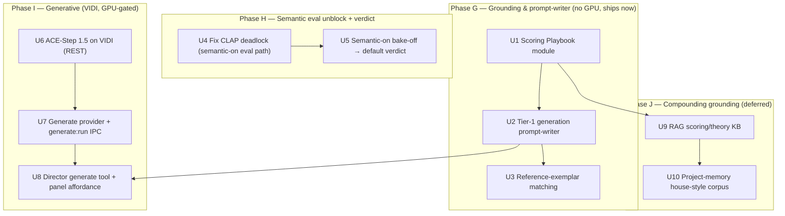
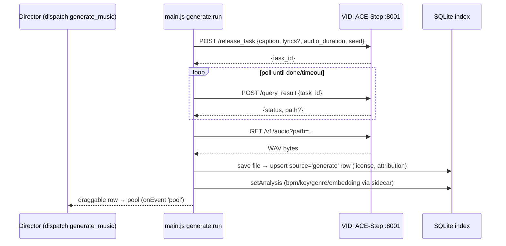

# feat: Generative Music Director + knowledge-grounding + agent-architecture resolution

**Created:** 2026-07-02
**Type:** feat
**Depth:** Deep
**Target repo:** akasi-sounds (`~/code/akasi/akasi-sounds`, private `Dlove7777/akasi-sounds`)
**Builds on:** `docs/plans/2026-07-01-001-feat-akasi-sounds-roadmap-plan.md` (its U9/U10 + KTD6/7/9 are the generation seam; this plan supersedes those two units with a corrected, sequenced version and adds grounding + eval that the roadmap did not cover).

---

## Summary

The in-app Music Director already curates cue sheets honestly from the real library (local + Freesound SFX + Jamendo CC music). This phase makes it **generate** when the library has no fit, **grounds** it in scoring craft so its picks and prompts are professional, and **settles** the grounded-vs-triad architecture question with a fair evaluation. The work is sequenced so the ~free, no-GPU wins land first: a Scoring Playbook baked into the director, a Tier-1 generation *prompt-writer* (analysis → a rich ACE-Step/Suno prompt, useful with no local model), and reference-exemplar matching. Then the semantic-eval unblock (fixing the CLAP deadlock) settles grounded-vs-triad. Only then the heavier, GPU-gated ACE-Step-on-VIDI deploy + in-app generation, and finally the compounding RAG + project-memory grounding. The arc the user experiences: **find → find-similar → generate**, with every generated asset landing as a real, draggable, license-stamped row.

---

## Problem Frame

The director is honest and useful but bounded by what exists: a "tense instrumental bed" against an SFX-heavy library returns thin results (field-confirmed this session). Two gaps: (1) it can't create a bed that isn't there, and (2) it curates with a general model's musical knowledge, not a working supervisor's craft (format-specific scoring conventions, genre fingerprints, house rules from a 35-year TV/film producer). Separately, the grounded-vs-triad architecture question is unresolved because the only bake-off ran keyword-only — triad's semantic retrievers scored zero candidates, an artifact, not a verdict. Generation, grounding, and a fair eval are the three moves that turn a competent librarian into a music supervisor. All three must preserve the honesty invariant (the model can only surface files a tool actually returned) and the local-first, client-safe-licensing posture, because output lands in paid client edits.

---

## Requirements

- **R1 — Scoring Playbook grounding.** The director's system context carries a curated, professional scoring playbook (theory cheatsheet, genre fingerprints, film/TV/commercial/short-form conventions, Dennis's house rules) without degrading honesty or tool-discipline.
- **R2 — Tier-1 generation prompt-writer.** Given a brief (and optionally an analyzed reference sample), the director produces a rich, structured text prompt suitable for ACE-Step/Suno/Udio — useful even with no local generator wired.
- **R3 — Reference-exemplar matching.** "Sounds like X" resolves as an audio-similarity job (CLAP find-similar against tagged anchor tracks), with the LLM supplying the textual style description — never a fabricated match.
- **R4 — Semantic-eval unblock.** A working path exists to evaluate the director with the CLAP semantic layer ON (the current headless harness can't warm CLAP).
- **R5 — Architecture verdict.** The grounded-vs-triad bake-off is re-run with semantic search ON; a default mode is chosen on evidence (honesty > tool-discipline > cost), with `google/gemini-3-flash-preview` grounded as the incumbent to beat.
- **R6 — ACE-Step generation service.** A commercial-viable generator (ACE-Step 1.5) runs on VIDI as a tailnet-reachable REST endpoint, health-checked, producing a WAV/mp3 from a text prompt.
- **R7 — In-app generation.** The director can generate a track that lands in the library as a `source='generate'` row — auditioned, cropped, and dragged to a timeline identically to any other sound.
- **R8 — Provenance & licensing.** Every generated row records model + license (`ACE-Step 1.5 / MIT`) and a provenance caveat; CC-BY-NC exclusion from client-safe exports stays enforced.
- **R9 — Compounding grounding (deferred tier).** Deeper scoring/theory references are retrievable (RAG), and past cue sheets + feedback accumulate into a house-style corpus the director draws on.
- **R10 — Honesty invariant preserved end-to-end.** Generated assets and retrieved references enter only through tools into the candidate pool / context; a machine-checked smoke assertion guarantees the model names no file absent from the pool.

---

## Key Technical Decisions

- **KTD1 — text2music-only for v1; audio-conditioning is deferred and experimental.** ACE-Step 1.5 ships reference-audio modes (`cover`, `repaint`, etc.), but the maintainer explicitly confirms `cover`/reference style-transfer is unreliable — it yields "slight melodic variations," not melody-preserving style transfer (ACE-Step-1.5 discussions/209). The guaranteed, production-safe route is text-prompt(+optional lyrics). "Make it sound like this clip" stays out of v1. If audio-editing is ever needed, `repaint` (timestamp-masked regen of the model's own output) is architecturally sounder than `cover`.
- **KTD2 — Analysis → rich text prompt is the guaranteed spine (Tier-1 ships standalone).** The prompt-writer is valuable with no GPU (paste into Suno/Udio/ACE-Step) and is *also* what feeds ACE-Step's params in Tier-2. Building it first de-risks the whole workstream: the useful half needs no infra.
- **KTD3 — ACE-Step 1.5 via its first-party async REST server, deployed by Docker-compose.** Repo `ace-step/ACE-Step-1.5`, **license MIT** (correcting the roadmap's KTD7/R9 "Apache-2.0"). Server: `POST /release_task` → poll `POST /query_result` → `GET /v1/audio?path=`; default `:8001`; compose files ship with weights pre-baked. The Generate provider is a thin polling client against this — do not adopt a third-party UI wrapper.
- **KTD4 — Generation is a separate, explicit tool/IPC — NOT folded into `search_online`.** `main.js`'s `remoteSearch` fans out across *all* available providers and merges; a generation provider there would fire (and burn GPU) on every online search. Generation gets its own `generate:run` IPC + `generate_music` director tool, gated on availability like `ONLINE_TOOL`, using the inert-until-ready pattern from `pixabay.js`.
- **KTD5 — Grounding by prompt + RAG + memory; NO fine-tuning.** Provenance risk is the reason: even permissively-licensed weights can have murky training data, and a fine-tune reintroduces exactly that exposure. Stay on pretrained CLAP + ACE-Step; ground via a Scoring Playbook, retrieval, and accumulated house-style — never a training step.
- **KTD6 — Playbook lives in one shared module (`src/playbook.js`).** The director prompt is currently hand-mirrored in three places (`src/director.js` `SYSTEM`, `agents/music-director/PROMPT.md`, `mcp/server.js`). The playbook is imported by `director.js` (and optionally `mcp/server.js`) so it never becomes a fourth drifting copy; `PROMPT.md` references it.
- **KTD7 — Generated WAV saved to a local `path` directly (not `url` + cache).** `ensureCached`'s `fetchBytes` is hardcoded to `freesound.fetchPreview` at all three call sites; saving the generated file to a generated-assets dir and setting `path` sidesteps that branch entirely and makes the row immediately analyzable (`needAnalysis` accepts `path`).
- **KTD8 — Honesty invariant extends to the new surfaces.** Generated assets enter the pool only via the generate tool; RAG references enter as *context*, never as pickable files. The mock-LLM smoke assertion (picks ⊆ real pool) is extended to both, so the guarantee is machine-checked, not aspirational.
- **KTD9 — Grounded stays the default until triad wins a fair, semantic-on re-bake.** The prior "triad = 0 candidates" result was a keyword-only artifact. The verdict is gated on R4's unblock; `deepseek-v4-flash` stays disqualified until it re-proves honesty.

---

## High-Level Technical Design

### Phasing (dependency-ordered)



Phase G ships with no GPU and no infra. Phase H is a tooling fix + eval. Phase I is GPU-gated on VIDI (Dennis's go). Phase J is the compounding moat, deferred behind G.

### Generation call — async job-queue client (U7)



*Directional guidance — exact endpoint/param names verified against ACE-Step-1.5 `docs/en/API.md` at build time; treat as the shape, not the signature.*

---

## Output Structure (new/changed)

```
akasi-sounds/
├── src/
│   ├── playbook.js            # NEW (U1) — shared Scoring Playbook string
│   ├── director.js            # + playbook in SYSTEM; write_generation_prompt,
│   │                          #   match_reference, generate_music, lookup_scoring_ref tools
│   ├── genprompt.js           # NEW (U2) — analysis→ACE-Step prompt builder
│   ├── rag.js                 # NEW (U9) — chunk/embed/retrieve over the KB
│   ├── db.js                  # + cue_history table (U10), gen provenance columns if needed
│   └── providers/
│       └── generate.js        # NEW (U7) — ACE-Step async REST client (NOT in search_online)
├── electron/
│   ├── main.js                # + generate:run IPC, ctx.generate closure into director:chat
│   └── preload.js             # + generate bridge
├── docs/
│   └── scoring/               # NEW (U9) — theory/genre/scoring reference corpus (markdown)
├── services/vidi-acestep/     # NEW (U6) — docker-compose + deploy notes for VIDI
└── scripts/
    ├── director-bakeoff.js    # semantic-on path (U5)
    └── smoke.js               # + asserts for U1/U2/U3/U7/U8/U9/U10
```

---

## Implementation Units

### U1. Scoring Playbook module + director grounding
**Goal:** Give the director a professional scoring playbook without a fourth prompt copy or an honesty regression.
**Requirements:** R1
**Dependencies:** none
**Files:** `src/playbook.js` (new), `src/director.js` (import + append to `SYSTEM`, and to `JUDGE_SYSTEM` for triad), `agents/music-director/PROMPT.md` (reference the playbook, don't duplicate), `scripts/smoke.js`
**Approach:** Author `src/playbook.js` exporting a single string: a compact music-theory cheatsheet, genre fingerprints (tempo/instrumentation/mood per genre), format-specific scoring conventions (film / TV / commercial / short-form), and Dennis's house rules. Import it into `director.js` and append to `SYSTEM` (and `JUDGE_SYSTEM`). Keep it a few thousand words max — it operationalizes what frontier models already know and adds house conventions; it is not a textbook. Optionally import into `mcp/server.js` tool descriptions later (KTD6). This is grounding context, not tool output — it never adds pickable files, so honesty is unaffected.
**Patterns to follow:** the existing `SYSTEM`/`ONLINE_TOOL` string structure in `src/director.js`; the shared-module import pattern used across `src/`.
**Test scenarios:**
- Playbook string is non-empty and is present in the assembled system context `runDirector` sends (assert the composed system message contains a known playbook sentinel phrase).
- Director honesty smoke still passes with the playbook active (picks ⊆ real pool) — grounding did not introduce a fabrication path.
- `Covers R1.` Playbook content includes at least the four format conventions (film/TV/commercial/short-form) — assert each keyword present.
**Verification:** `npm run test:core` green with the new asserts; a manual director run visibly reasons with scoring conventions.

### U2. Tier-1 generation prompt-writer
**Goal:** Turn a brief (optionally + an analyzed reference sample) into a rich ACE-Step/Suno text prompt — useful with no generator wired.
**Requirements:** R2
**Dependencies:** U1
**Files:** `src/genprompt.js` (new), `src/director.js` (`write_generation_prompt` tool: schema + `buildTools` + `dispatch` branch), `scripts/smoke.js`
**Approach:** `src/genprompt.js` builds a structured generation prompt from: the brief, the Scoring Playbook conventions (U1), and — when a reference file path is supplied — attributes from `sidecar.classify(path)` + `analyzeBatch` (genre, vocals, bpm, mood). Output object: `{ caption, lyrics?, suggestedDurationSec, bpm?, genre?, notes }`. Expose as a director tool `write_generation_prompt({brief, samplePath?})`; the dispatch branch calls `genprompt` and returns the structured prompt as tool output (text the user can copy). No network to VIDI; reuses `sidecar` only when a sample is given. This is the guaranteed spine (KTD2) and the input contract Tier-2 (U8) consumes.
**Patterns to follow:** `ONLINE_TOOL` conditional-tool shape; `similar:byFile` (`main.js`) for the `sidecar.embedAudio/classify`-on-arbitrary-file pattern.
**Test scenarios:**
- `Covers R2.` With a brief and no sample, returns a well-formed prompt object with a non-empty `caption` and a plausible `suggestedDurationSec`.
- With a mock `sidecar.classify` returning `{genre:'Cinematic', vocals:0, bpm:78}`, the built prompt reflects those attributes (instrumental, ~78 bpm, cinematic).
- Director tool path: a mock LLM that calls `write_generation_prompt` receives structured tool output and can render it — no fabricated file claims (honesty smoke).
**Verification:** Smoke asserts pass; a director run for "a tense bed" yields a copy-pasteable ACE-Step prompt.

### U3. Reference-exemplar matching ("sounds like X")
**Goal:** Resolve "sounds like <artist/track>" as a CLAP audio-similarity job against tagged anchors, LLM supplying only the style description.
**Requirements:** R3
**Dependencies:** U1
**Files:** `src/director.js` (`match_reference` tool → reuses `similarByEmbedding`), `electron/main.js` (expose an anchor-match closure into `ctx`, or reuse `findSimilar`), `scripts/smoke.js`
**Approach:** Add a `match_reference({description, anchorId?})` tool. When an `anchorId` (a library row the user tagged as "this is the Kanye-ish one") is given, return `similarByEmbedding` neighbors. When only a description is given, embed it via `sidecar.embedText` and cosine against `db.allEmbeddings()` (the semantic branch already in `blendedSearch`) — the LLM writes the style description, CLAP supplies the sonic match. Results enter the pool as real rows. No new similarity engine — this is a thin director-facing wrapper over the built cosine path.
**Patterns to follow:** `src/search.js` `similarByEmbedding`; the `similar:byId` IPC in `main.js`.
**Test scenarios:**
- `Covers R3.` `match_reference` with an `anchorId` returns real rows ranked by cosine, excluding the anchor.
- Description-only match embeds text and returns library rows (mock `sidecar.embedText`), all of which exist in the DB (honesty).
- Empty/again-thin library → returns few/zero rows without error.
**Verification:** Smoke asserts pass; a director run "find something that sounds like a lo-fi Nujabes beat" surfaces real similar rows.

### U4. Fix CLAP warm-up under ELECTRON_RUN_AS_NODE (semantic-eval path)
**Goal:** Make a semantic-ON evaluation possible — the current headless harness deadlocks warming CLAP.
**Requirements:** R4
**Dependencies:** none
**Files:** `src/sidecar.js` (`startClap` spawn/stdio handling), `scripts/director-bakeoff.js`, `scripts/smoke.js`
**Approach:** Diagnose the `startClap()` deadlock under `ELECTRON_RUN_AS_NODE` (likely stdio/pipe handling or an Electron-runtime expectation the run-as-node child lacks). Two candidate fixes, pick by what the diagnosis shows: (a) adjust the child spawn (explicit `stdio`, env, or `ELECTRON_RUN_AS_NODE` propagation to the Python bridge) so the ready handshake completes; or (b) provide an alternate eval entry that warms CLAP in a real Electron main context. Whichever lands, expose a reliable "CLAP ready in headless eval" capability. In-library similarity already needs no warm-up (embeddings are on disk) — this is specifically for *new text/audio* query embedding during eval.
**Execution note:** Start with a minimal reproduction: a tiny script under the same `ELECTRON_RUN_AS_NODE` harness that only calls `startClap()` and logs where it hangs. Fix against that before touching the bake-off.
**Test scenarios:**
- Repro script: `startClap()` resolves (ready) within a bounded timeout under the eval harness — no deadlock.
- `embedText("dark tension")` returns a 512-d vector in the eval harness after warm-up.
- Fallback intact: with the sidecar absent, eval still runs keyword-only without crashing.
**Verification:** The repro resolves; a semantic query returns an embedding headlessly.

### U5. Semantic-on bake-off → architecture verdict
**Goal:** Re-run grounded vs triad with CLAP ON and choose the default on evidence.
**Requirements:** R5
**Dependencies:** U4
**Files:** `scripts/director-bakeoff.js` (warm CLAP + `clapReady:true` path), `docs/plans/DIRECTOR-BAKEOFF-RESULTS.md` (regenerated), `src/director.js` / `electron/main.js` (only if the default mode changes)
**Approach:** With U4's capability, set `clapReady:true` in the harness so `blendedSearch` uses the semantic branch and triad's retrievers actually retrieve. Re-run the matrix (grounded vs triad × the candidate models), keeping the corrected ranking (productive configs first; honesty > tool-discipline > cost). Update the results doc. If triad clearly beats grounded on honesty and cue quality at acceptable cost/latency, switch the default (`opts.mode` default in `main.js` + `DirectorPanel`); otherwise keep grounded (KTD9) and record why. Keep spend small (`--quick`, few briefs).
**Test scenarios:**
- Harness runs with `clapReady:true` and triad now returns non-zero candidate pools (the artifact is gone).
- `honestyReport` still flags any fabricated filename (guard intact under semantic mode).
- Results doc writes a ranked table with a productive-first ordering and a stated recommendation.
**Verification:** `DIRECTOR-BAKEOFF-RESULTS.md` shows a fair grounded-vs-triad comparison with a defensible default.

### U6. ACE-Step 1.5 generation service on VIDI *(deferred build — GPU-gated)*
**Goal:** A commercial-viable generator reachable over the tailnet.
**Requirements:** R6
**Dependencies:** none (infra), but confirm VIDI VRAM first
**Files:** `services/vidi-acestep/` (docker-compose + deploy/launch notes + health-check script)
**Approach (KTD3):** Deploy `ace-step/ACE-Step-1.5` on VIDI via its shipped Docker-compose (weights pre-baked), running the first-party API server on `:8001` (confirm vs the house `:9000` convention — see Open Questions). Expose on the tailnet like the existing ComfyUI/Whisper services. Set `ACESTEP_API_KEY`. Health-check (`/health`, `/v1/models`) + one smoke generation (`text2music`, ~30s). Pick a VRAM-appropriate model variant (2B-turbo with INT8/offload floor if headroom is tight; XL if ample) — benchmark latency for a realistic 30–120s cue before committing UX expectations.
**Execution note:** Infra deploy; gated on Dennis's go (per "don't push to launch"). Confirm VRAM headroom on VIDI before install; ACE-Step latency claims (<10s on 3090) are best-case/turbo — measure XL-quality at real durations.
**Test scenarios (service-level):**
- `/health` and `/v1/models` respond; server starts from compose.
- `POST /release_task {task_type:text2music, caption, audio_duration:30}` → `task_id`; polling `/query_result` reaches done; `/v1/audio` returns a playable WAV of ~30s.
- Repeated calls don't leak/hang; a second generation succeeds after the first.
**Verification:** `curl` the tailnet endpoint → playable WAV at the requested duration, within a measured latency budget.

### U7. Generate provider + `generate:run` IPC *(deferred build — depends on U6)*
**Goal:** Turn a prompt into a `source='generate'` library row that behaves like any other sound.
**Requirements:** R7, R8
**Dependencies:** U6
**Files:** `src/providers/generate.js` (new), `src/providers/index.js` (register, but see KTD4), `electron/main.js` (`generate:run` IPC + save-to-path + upsert + analyze), `electron/preload.js` (bridge), `scripts/smoke.js`
**Approach (KTD4, KTD7):** `src/providers/generate.js` is the async ACE-Step client: `release_task` → poll `query_result` → `GET /v1/audio` → return bytes + metadata. `available()` gates on `VIDI_ACESTEP_URL` (env, `~/.secrets.env`). **Do not let generation fire from `remoteSearch`'s fan-out** — either omit it from the `search_online` provider loop or guard the loop to skip `source==='generate'`. `generate:run` IPC: call the client, save the WAV to a generated-assets dir under `userData`, `upsertSound({source:'generate', source_id: hash(prompt+params+ts), name, path, kind:'music', license:'ACE-Step 1.5 / MIT', attribution:'Generated · ACE-Step 1.5 — '+prompt, duration})`, then `setAnalysis` via the sidecar (bpm/key/genre/embedding), and return the hydrated row. Reuse the hardened fetch discipline (ASCII headers, AbortController timeout) from `src/director.js`.
**Patterns to follow:** `jamendo.js` normalize shape; the `remoteSearch` "provider hit → upsert → rehydrate → row" flow in `main.js`; `analyze:run` for the `setAnalysis` attach.
**Test scenarios:**
- `Covers R7.` With a mock generate client returning canned WAV bytes + metadata, `generate:run` produces a `source='generate'` row that exists in the DB, has `path` set, and is returned hydrated.
- `Covers R8.` The generated row carries `license==='ACE-Step 1.5 / MIT'` and a prompt-bearing attribution; `credits.classifyLicense` maps it to `generated`; a client-safe export includes it (MIT is client-safe) while CC-BY-NC rows stay excluded.
- Generation does **not** appear in a `search_online` fan-out result (assert the online-merge path skips the generate provider).
- Generated row is analyzable: `setAnalysis` attaches an embedding (mock sidecar) and the row becomes find-similar-able.
**Verification:** Smoke asserts pass headlessly with mocks; end-to-end against live VIDI produces a draggable generated row.

### U8. Director `generate_music` tool + panel affordance *(deferred build — depends on U7)*
**Goal:** The director can generate on demand; the result is a live, draggable candidate — completing find → find-similar → generate.
**Requirements:** R7, R10
**Dependencies:** U7, U2
**Files:** `src/director.js` (`generate_music` tool: schema + `buildTools(hasRemote, hasGenerate)` + `dispatch` branch calling `ctx.generate`), `electron/main.js` (`director:chat` passes a `generate` closure into `ctx`, mirroring `remoteSearch`), `renderer/components/DirectorPanel.jsx` (a `type:'generating'` progress event), `scripts/smoke.js`
**Approach:** `generate_music({brief|prompt, durationSec})` — the dispatch branch builds params (reusing U2's `genprompt` when given a brief rather than a finished prompt), calls `ctx.generate(...)`, which runs the U7 `generate:run` flow, and adds the resulting real row to `pool` with an `onEvent({type:'pool'})`. Add an `onEvent({type:'generating'})` so the panel shows progress during the (multi-second) generation. Honesty invariant holds by construction: the generated row is a real DB row in the pool, not an invented name (KTD8). Keep the tool conditional on `hasGenerate` (availability), exactly like `ONLINE_TOOL` is on `remoteSearch`.
**Patterns to follow:** `ONLINE_TOOL` + `dispatch` `search_online` branch; `ctx.remoteSearch` closure injection in `runDirector`/`main.js`; `DirectorPanel` `onDirectorEvent` handling.
**Test scenarios:**
- `Covers R10.` A mock LLM that calls `generate_music` (with a mock `ctx.generate` returning a canned generated row) ends with the generated row in `pool`, and the final answer references only pooled rows (honesty smoke extended to generated assets).
- `generate_music` tool is offered only when `hasGenerate` is true (mirrors the `search_online` gating assertion).
- A `generating` event is emitted before the `pool` event (progress affordance).
**Verification:** Smoke asserts pass; in-app, asking the director to "generate a 30s tense bed" streams progress then drops a draggable generated row into the panel.

### U9. RAG scoring/theory knowledge base *(deferred build)*
**Goal:** Deeper scoring/theory/genre references retrievable on demand, without fine-tuning.
**Requirements:** R9, R10
**Dependencies:** U1
**Files:** `src/rag.js` (new — chunk/embed/retrieve), `docs/scoring/` (new — markdown reference corpus), `src/director.js` (`lookup_scoring_ref` tool), `src/db.js` (a small embeddings table for KB chunks, or reuse a JSON index), `scripts/smoke.js`
**Approach (KTD5, KTD8):** Curate a small markdown corpus under `docs/scoring/` (theory, genre deep-dives, format-specific scoring craft). At build/index time, chunk it and embed each chunk via `sidecar.embedText` (the same CLAP text encoder), storing vectors. Add a `lookup_scoring_ref({query})` director tool that embeds the query, cosine-retrieves top-k chunks, and returns them as **context** (clearly framed as reference text, not pickable files). The playbook (U1) is the always-on seed; RAG is the on-demand deep layer. Retrieved refs never become candidate picks — the honesty smoke asserts the pool is unchanged by a `lookup_scoring_ref` call.
**Patterns to follow:** `src/search.js` cosine retrieval over `allEmbeddings`; `sidecar.embedText`; the conditional-tool + dispatch pattern.
**Test scenarios:**
- `Covers R9.` `lookup_scoring_ref("how to score a tense corporate promo")` returns relevant chunks from the corpus (mock or real embeddings), ranked by cosine.
- `Covers R10.` A director run that calls `lookup_scoring_ref` adds zero files to the candidate pool — references are context only (honesty invariant).
- Sidecar/model absent → tool returns a graceful "reference lookup unavailable" without crashing.
**Verification:** Retrieval returns on-topic references; the pool-unchanged assertion passes.

### U10. Project-memory house-style corpus *(deferred build)*
**Goal:** Past cue sheets + Dennis's feedback accumulate into a retrievable house-style store — the compounding moat.
**Requirements:** R9
**Dependencies:** U9
**Files:** `src/db.js` (a `cue_history` table: brief, picks, final cue text, feedback, ts), `electron/main.js` (persist a cue on director completion; capture feedback), `src/director.js` (`recall_house_style` tool over past cues), `scripts/smoke.js`
**Approach:** Persist each completed director interaction (brief, chosen picks by id, final cue text, and any thumbs/edit feedback) to a `cue_history` table. Embed the brief+cue for retrieval (reuse the U9 RAG path). Add a `recall_house_style({brief})` tool that surfaces the closest past cues as context ("last time you scored a promo like this, you used X, Y and noted Z"). Over time this biases the director toward Dennis's established choices — retrieval, never fine-tuning (KTD5). Feedback capture can start minimal (store the cue; add explicit thumbs later).
**Patterns to follow:** `src/db.js` table + method conventions; U9's embed/retrieve; `markUsed`-style write-on-event in `main.js`.
**Test scenarios:**
- A completed director run writes a `cue_history` row (brief + picks + cue text).
- `recall_house_style` retrieves a prior cue for a similar brief (cosine over stored brief embeddings), returned as context only (pool unchanged — honesty).
- Empty history → tool returns nothing gracefully.
**Verification:** History persists across runs; recall surfaces relevant prior cues without polluting the pick pool.

---

## Scope Boundaries

**In scope now (build + verify this pass):** Phase G (U1–U3) — no GPU, ships immediately — and Phase H (U4–U5) — the deadlock fix + semantic-on verdict.

### Deferred to Follow-Up Work
- **U6–U8 — ACE-Step on VIDI + in-app generation:** GPU infra; gated on Dennis's go + a VRAM/latency check on VIDI.
- **U9–U10 — RAG KB + project-memory corpus:** the compounding grounding tier; follows U1 and the generation spine.
- **Generation as an MCP capability:** the MCP door is read-only by design; generation is a write — keep it app-only for v1 (see Open Questions).

### Outside this product's identity
- **Audio-reference / style-transfer generation ("make it sound like this clip"):** maintainer-acknowledged unreliable in ACE-Step 1.5 (KTD1); not a v1 feature.
- **Fine-tuning / training a model:** reintroduces the provenance risk the whole approach avoids (KTD5).
- **Vocal-forward, chart-ready song generation:** open models lag proprietary here; scope generation to instrumental beds/underscore.
- **YuE as the generator:** no first-party server, 80GB-class hardware, ~360s/30s-audio on a 4090 — wrong fit for a responsive REST-on-one-GPU design.

---

## Risks & Dependencies

- **ACE-Step training-data provenance is undocumented (client-work risk).** MIT license permits commercial use, but the repo carries an output-similarity disclaimer and no training-corpus audit. Mitigation: stamp provenance on every generated row (KTD7), keep the NC-exclusion enforced, and treat generated beds as "verify originality if imitating a protected style." For the most provenance-defensible client deliverables, a future CC-trained generator (Stable Audio Open) or MIDI remains the fallback.
- **VIDI VRAM / latency reality.** The <10s-on-3090 figure is best-case/turbo; XL-quality at 2–4 min could be materially slower. Confirm VRAM headroom and benchmark real durations (U6) before promising interactive generation latency.
- **CLAP-deadlock fix may be non-trivial** (stdio/pipe under `ELECTRON_RUN_AS_NODE`). Fallback if the spawn fix resists: run the semantic eval under a real Electron main context (U4 alternate). Until U4 lands, the triad verdict (U5) is blocked — do not ship a mode switch on keyword-only evidence.
- **Honesty regression surface.** Generation and RAG add new ways for the model to reference things; the machine-checked pool-only-from-tools assertion (KTD8) must be extended in the same unit that adds each surface, not after.
- **Port ambiguity.** Roadmap says ACE-Step `:8001`; other VIDI services run `:9000`. Make the endpoint a configurable env (`VIDI_ACESTEP_URL`) and confirm at deploy.
- **Prompt drift across surfaces.** The director prompt is mirrored in three files; the playbook must be a shared module (KTD6) or it becomes a fourth copy that silently diverges.

### Cross-cutting conventions (from prior learnings)
- Never run DB scripts with bare `node` — always `ELECTRON_RUN_AS_NODE=1 <electron>` (ABI flip); recover with `npm run rebuild`.
- Every backend change gets an `ok()` smoke assert with injected mocks for anything networked; `npm run test:core` + `npm run build:renderer` green; commit+push per unit.
- Reuse `src/director.js`'s hardened OpenRouter fetch (ASCII headers, AbortController) — don't hand-roll a client.
- macOS has no GNU `timeout` → `perl -e 'alarm N; exec @ARGV'`.

---

## Open Questions

- **ACE-Step port on VIDI:** `:8001` (ACE-Step default) vs the house `:9000` convention — resolve at deploy; plan uses a configurable `VIDI_ACESTEP_URL`.
- **Generation as an MCP tool?** The MCP door is read-only by design. Recommendation: app-only for v1 (generation is a write + GPU spend); revisit if Hermes needs to generate.
- **Model variant on VIDI:** 2B-turbo (low VRAM, fastest) vs XL (higher quality, more VRAM) — decide from the VRAM check + a latency/quality A/B in U6.
- **Feedback capture depth for U10:** start with implicit (store every cue) vs add explicit thumbs/edits now — recommend implicit first, explicit later.

---

## Sources & Research

- **ACE-Step 1.5** — repo `ace-step/ACE-Step-1.5` (MIT, first-party async REST server `:8001`, Docker-compose with weights pre-baked, params incl. `task_type`/`audio_duration`/`lyrics`, output flac/mp3/wav): [github.com/ace-step/ACE-Step-1.5](https://github.com/ace-step/ACE-Step-1.5), [API.md](https://github.com/ace-step/ACE-Step-1.5/blob/main/docs/en/API.md), [arXiv 2602.00744](https://arxiv.org/abs/2602.00744)
- **Audio-conditioning unreliability** (maintainer-confirmed `cover` = "slight melodic variations", not style transfer): [ACE-Step-1.5 discussions/209](https://github.com/ace-step/ACE-Step-1.5/discussions/209)
- **YuE** (Apache-2.0, no server, 80GB-class HW — ruled out as primary): [github.com/multimodal-art-projection/YuE](https://github.com/multimodal-art-projection/YuE)
- **Quality reality-check vs Suno/Udio** (read skeptically, SEO-adjacent; good-enough for instrumental beds): fm9.ai / heart-mula comparison signal
- **Prior roadmap** (generation seam, KTD6/7/9, U9/U10 — this plan corrects Apache→MIT and sequences grounding + eval it omitted): `docs/plans/2026-07-01-001-feat-akasi-sounds-roadmap-plan.md`
- **Bake-off methodology + honesty invariant + ABI/CLAP gotchas:** `docs/plans/DIRECTOR-BAKEOFF-RESULTS.md`, `docs/plans/LOOP-PLAN.md`, `src/director.js`, `scripts/director-bakeoff.js`
